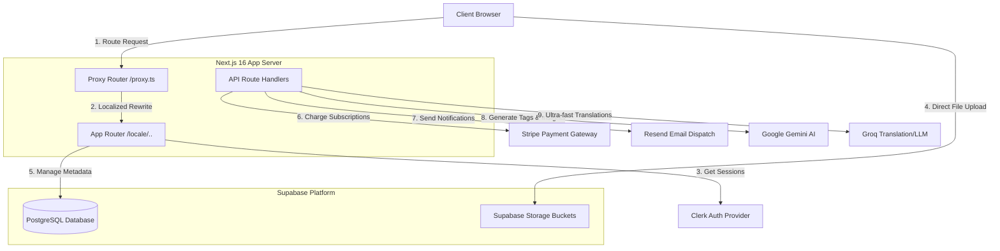
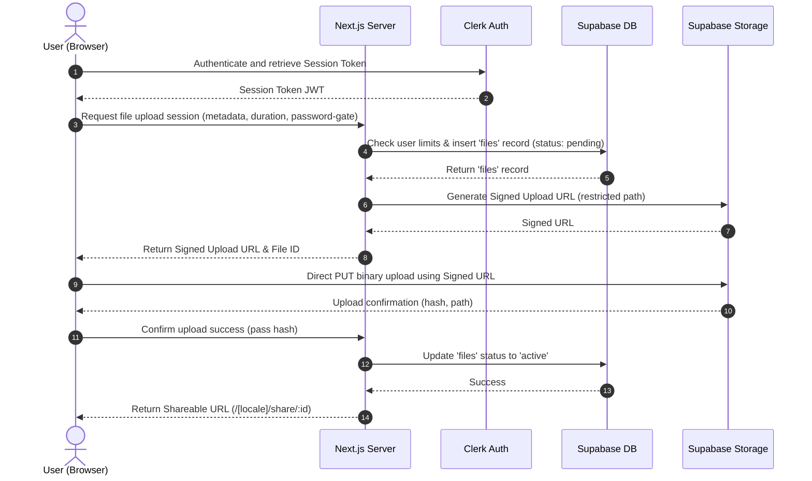
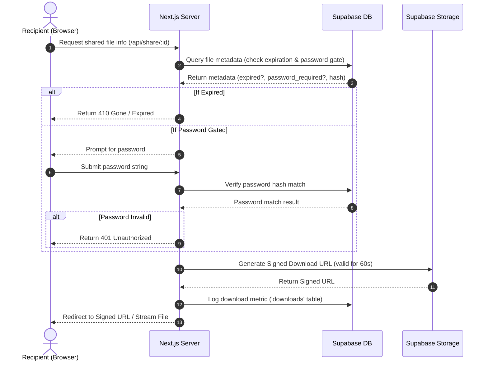

# KavShare Technical Architecture Document

This document provides a comprehensive overview of the system architecture, component relationships, data flow models, technology stack selections, security postures, and performance optimization guidelines for the KavShare platform.

---

## 1. System Overview & Component Relationships

KavShare is a high-performance, secure, and localized file sharing web application built with a modern hybrid serverless topology. The application coordinates user authentication, file metadata tracking, direct S3-compatible storage, subscription billing, and AI metadata enrichment.

---

## 2. Core Data Flows

### A. Upload & Share Flow

To maximize network efficiency and reduce web server resource consumption, files are uploaded directly from the client browser to Supabase Storage using short-lived, pre-signed upload URLs.

### B. Download & Decryption Flow

Downloads are protected by validation checks (checking link expirations, password gates, and user download counters) before yielding the file asset.

---

## 3. Technology Stack Justification

| Technology             | Selection               | Justification                                                                                                                                               |
| :--------------------- | :---------------------- | :---------------------------------------------------------------------------------------------------------------------------------------------------------- |
| **Core Framework**     | Next.js 16 (App Router) | Combines Server-Side Rendering (SSR) for fast dynamic pages, Server Components for secure data loading, and Route Handlers for serverless background tasks. |
| **View Layer**         | React 19                | Brings native Server Actions, optimized resource loading hooks, and compilation enhancements that minimize runtime scripting sizes.                         |
| **Styling**            | Tailwind CSS v4         | Delivers compiled-utility styles with a zero-runtime CSS footprint, accelerating browser paint times.                                                       |
| **Database & Storage** | Supabase                | Managed PostgreSQL database equipped with Row-Level Security (RLS) and native S3-compatible object buckets to store binaries.                               |
| **User Identity**      | Clerk Authentication    | Offloads complex authentication states, MFA, session management, and OAuth integrations, reducing compliance overhead.                                      |
| **Billing Gateway**    | Stripe                  | Industry standard billing APIs that handle multi-tier subscriptions, taxes, and automatic payment webhooks.                                                 |
| **AI Processing**      | Google Gemini & Groq    | Gemini handles structured content summarization and analysis; Groq handles high-throughput, low-latency text translation.                                   |
| **Schema Validation**  | Zod                     | Enforces strict, type-safe API requests, validating request bodies at compile and runtime.                                                                  |

---

## 4. Performance Considerations

- **Direct-to-S3 Uploads**: File binaries never route through the Next.js server. Bypassing the App Router server prevents memory bloat, high CPU utilization, and socket exhaustion, allowing the platform to scale gracefully to support large files.
- **Edge Middleware Proxy Routing**: Sub-path localization routing is intercepted using a modern rewrite proxy (`src/proxy.ts`), resolving language headers at the edge under 1ms.
- **Image Optimization**: Configured remote domains and modern format fallbacks (`webp`, `avif`) in `next.config.ts` to ensure assets are compressed and served via optimized cache intervals.
- **Asynchronous Processing**: Non-critical actions (sending notification emails via Resend, indexing shared files, generating AI tags) are offloaded to background queues or execution threads, returning instant responses to the client.

---

## 5. Security Model Overview

- **Row-Level Security (RLS)**: Enforced directly on Supabase tables. Clerk JSON Web Tokens (JWT) are mapped to Postgres session variables, guaranteeing users can only access their respective files or logs.
- **Short-Lived Signed URLs**: Files in Supabase storage are kept private. Public access is granted exclusively via short-lived pre-signed URLs generated on-demand only after authentication checks pass.
- **Elevated Operations Gate**: Privileged operations (cron cleanup tasks, database seeding) are isolated on Next.js server components and signed with the `SUPABASE_SERVICE_ROLE_KEY`. This key is never exposed to the client.
- **Secret Management**: Sensitive keys are loaded into memory via environment variables (`.env.local` in development, container envs in production) and excluded from the Git repository.
